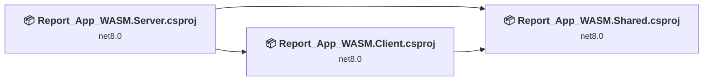
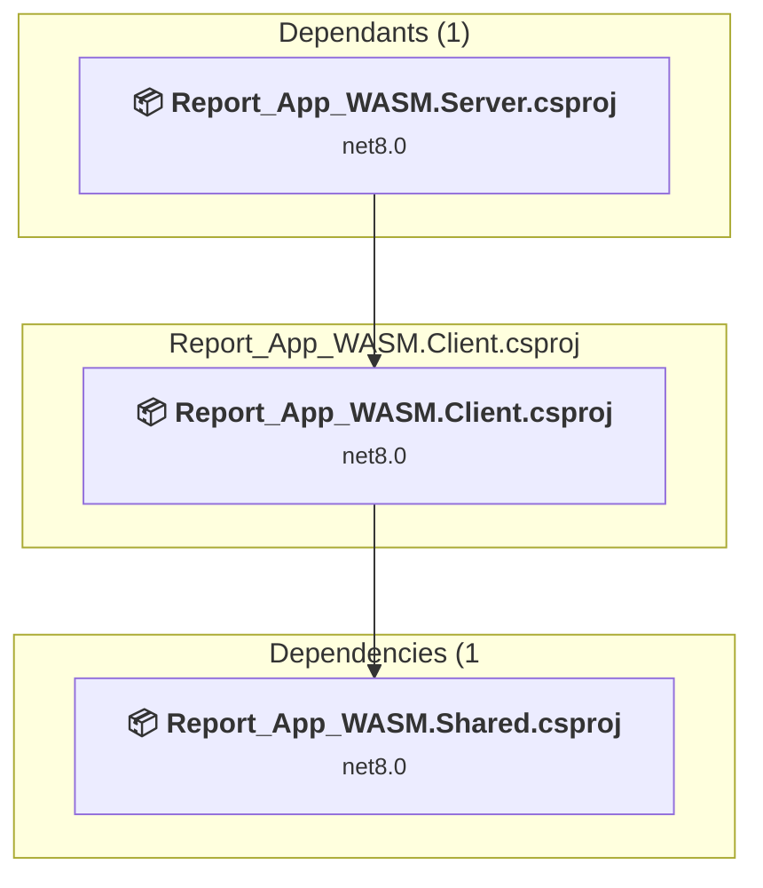
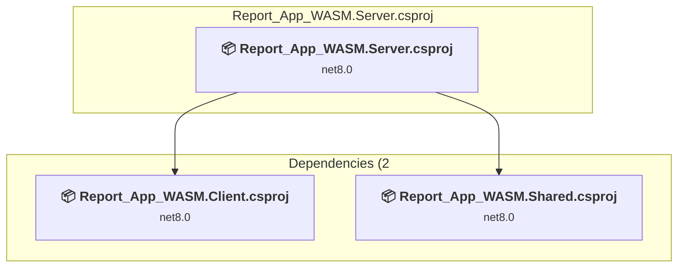
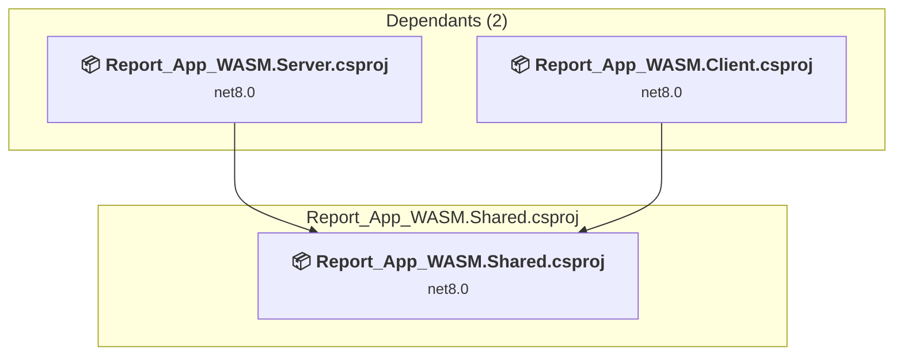

# Projects and dependencies analysis

This document provides a comprehensive overview of the projects and their dependencies in the context of upgrading to .NETCoreApp,Version=v10.0.

## Table of Contents

- [Executive Summary](#executive-Summary)
  - [Highlevel Metrics](#highlevel-metrics)
  - [Projects Compatibility](#projects-compatibility)
  - [Package Compatibility](#package-compatibility)
  - [API Compatibility](#api-compatibility)
- [Aggregate NuGet packages details](#aggregate-nuget-packages-details)
- [Top API Migration Challenges](#top-api-migration-challenges)
  - [Technologies and Features](#technologies-and-features)
  - [Most Frequent API Issues](#most-frequent-api-issues)
- [Projects Relationship Graph](#projects-relationship-graph)
- [Project Details](#project-details)

  - [Report_App_WASM\Client\Report_App_WASM.Client.csproj](#report_app_wasmclientreport_app_wasmclientcsproj)
  - [Report_App_WASM\Server\Report_App_WASM.Server.csproj](#report_app_wasmserverreport_app_wasmservercsproj)
  - [Report_App_WASM\Shared\Report_App_WASM.Shared.csproj](#report_app_wasmsharedreport_app_wasmsharedcsproj)

## Executive Summary

### Highlevel Metrics

| Metric | Count | Status |
| :--- | :---: | :--- |
| Total Projects | 3 | All require upgrade |
| Total NuGet Packages | 39 | 14 need upgrade |
| Total Code Files | 212 |  |
| Total Code Files with Incidents | 13 |  |
| Total Lines of Code | 23414 |  |
| Total Number of Issues | 104 |  |
| Estimated LOC to modify | 83+ | at least 0.4% of codebase |

### Projects Compatibility

| Project | Target Framework | Difficulty | Package Issues | API Issues | Est. LOC Impact | Description |
| :--- | :---: | :---: | :---: | :---: | :---: | :--- |
| [Report_App_WASM\Client\Report_App_WASM.Client.csproj](#report_app_wasmclientreport_app_wasmclientcsproj) | net8.0 | 🟢 Low | 3 | 32 | 32+ | AspNetCore, Sdk Style = True |
| [Report_App_WASM\Server\Report_App_WASM.Server.csproj](#report_app_wasmserverreport_app_wasmservercsproj) | net8.0 | 🟢 Low | 15 | 51 | 51+ | AspNetCore, Sdk Style = True |
| [Report_App_WASM\Shared\Report_App_WASM.Shared.csproj](#report_app_wasmsharedreport_app_wasmsharedcsproj) | net8.0 | 🟢 Low | 0 | 0 |  | ClassLibrary, Sdk Style = True |

### Package Compatibility

| Status | Count | Percentage |
| :--- | :---: | :---: |
| ✅ Compatible | 25 | 64.1% |
| ⚠️ Incompatible | 2 | 5.1% |
| 🔄 Upgrade Recommended | 12 | 30.8% |
| ***Total NuGet Packages*** | ***39*** | ***100%*** |

### API Compatibility

| Category | Count | Impact |
| :--- | :---: | :--- |
| 🔴 Binary Incompatible | 3 | High - Require code changes |
| 🟡 Source Incompatible | 52 | Medium - Needs re-compilation and potential conflicting API error fixing |
| 🔵 Behavioral change | 28 | Low - Behavioral changes that may require testing at runtime |
| ✅ Compatible | 103442 |  |
| ***Total APIs Analyzed*** | ***103525*** |  |

## Aggregate NuGet packages details

| Package | Current Version | Suggested Version | Projects | Description |
| :--- | :---: | :---: | :--- | :--- |
| AutoMapper | 15.0.1 |  | [Report_App_WASM.Server.csproj](#report_app_wasmserverreport_app_wasmservercsproj) | ✅Compatible |
| AutoMapper.Extensions.ExpressionMapping | 9.0.1 |  | [Report_App_WASM.Server.csproj](#report_app_wasmserverreport_app_wasmservercsproj) | ✅Compatible |
| Azure.Identity | 1.16.0 |  | [Report_App_WASM.Server.csproj](#report_app_wasmserverreport_app_wasmservercsproj) | ⚠️NuGet package is deprecated |
| Blazor.AceEditorJs | 1.2.1 |  | [Report_App_WASM.Client.csproj](#report_app_wasmclientreport_app_wasmclientcsproj) | ✅Compatible |
| Blazor.PivotTable | 1.0.8 |  | [Report_App_WASM.Client.csproj](#report_app_wasmclientreport_app_wasmclientcsproj) | ✅Compatible |
| Blazor.SimpleGrid | 8.0.1 |  | [Report_App_WASM.Client.csproj](#report_app_wasmclientreport_app_wasmclientcsproj) [Report_App_WASM.Server.csproj](#report_app_wasmserverreport_app_wasmservercsproj) | ✅Compatible |
| Blazor-ApexCharts | 6.0.2 |  | [Report_App_WASM.Client.csproj](#report_app_wasmclientreport_app_wasmclientcsproj) | ✅Compatible |
| BlazorDownloadFile | 2.4.0.2 |  | [Report_App_WASM.Client.csproj](#report_app_wasmclientreport_app_wasmclientcsproj) | ✅Compatible |
| CodeBeam.MudBlazor.Extensions | 8.2.4 |  | [Report_App_WASM.Client.csproj](#report_app_wasmclientreport_app_wasmclientcsproj) | ✅Compatible |
| CronExpressionDescriptor | 2.44.0 |  | [Report_App_WASM.Client.csproj](#report_app_wasmclientreport_app_wasmclientcsproj) | ✅Compatible |
| CsvHelper | 33.1.0 |  | [Report_App_WASM.Server.csproj](#report_app_wasmserverreport_app_wasmservercsproj) | ✅Compatible |
| EPPlus | 7.7.3 |  | [Report_App_WASM.Server.csproj](#report_app_wasmserverreport_app_wasmservercsproj) | ✅Compatible |
| FluentFTP | 53.0.1 |  | [Report_App_WASM.Server.csproj](#report_app_wasmserverreport_app_wasmservercsproj) | ✅Compatible |
| FluentValidation | 12.0.0 |  | [Report_App_WASM.Client.csproj](#report_app_wasmclientreport_app_wasmclientcsproj) | ✅Compatible |
| Hangfire.AspNetCore | 1.8.21 |  | [Report_App_WASM.Server.csproj](#report_app_wasmserverreport_app_wasmservercsproj) | ✅Compatible |
| Hangfire.SqlServer | 1.8.21 |  | [Report_App_WASM.Server.csproj](#report_app_wasmserverreport_app_wasmservercsproj) | ✅Compatible |
| Microsoft.AspNetCore.Components.WebAssembly | 8.0.20 | 10.0.3 | [Report_App_WASM.Client.csproj](#report_app_wasmclientreport_app_wasmclientcsproj) [Report_App_WASM.Server.csproj](#report_app_wasmserverreport_app_wasmservercsproj) | NuGet package upgrade is recommended |
| Microsoft.AspNetCore.Components.WebAssembly.Authentication | 8.0.20 | 10.0.3 | [Report_App_WASM.Client.csproj](#report_app_wasmclientreport_app_wasmclientcsproj) [Report_App_WASM.Server.csproj](#report_app_wasmserverreport_app_wasmservercsproj) | NuGet package upgrade is recommended |
| Microsoft.AspNetCore.Components.WebAssembly.Server | 8.0.20 | 10.0.3 | [Report_App_WASM.Server.csproj](#report_app_wasmserverreport_app_wasmservercsproj) | NuGet package upgrade is recommended |
| Microsoft.AspNetCore.Diagnostics.EntityFrameworkCore | 8.0.20 | 10.0.3 | [Report_App_WASM.Server.csproj](#report_app_wasmserverreport_app_wasmservercsproj) | NuGet package upgrade is recommended |
| Microsoft.AspNetCore.Identity.EntityFrameworkCore | 8.0.20 | 10.0.3 | [Report_App_WASM.Server.csproj](#report_app_wasmserverreport_app_wasmservercsproj) | NuGet package upgrade is recommended |
| Microsoft.AspNetCore.Identity.UI | 8.0.20 | 10.0.3 | [Report_App_WASM.Server.csproj](#report_app_wasmserverreport_app_wasmservercsproj) | NuGet package upgrade is recommended |
| Microsoft.AspNetCore.OData | 9.4.0 |  | [Report_App_WASM.Server.csproj](#report_app_wasmserverreport_app_wasmservercsproj) | ✅Compatible |
| Microsoft.EntityFrameworkCore.SqlServer | 9.0.9 | 10.0.3 | [Report_App_WASM.Server.csproj](#report_app_wasmserverreport_app_wasmservercsproj) | NuGet package upgrade is recommended |
| Microsoft.EntityFrameworkCore.Tools | 9.0.9 | 10.0.3 | [Report_App_WASM.Server.csproj](#report_app_wasmserverreport_app_wasmservercsproj) | NuGet package upgrade is recommended |
| Microsoft.Extensions.Localization | 9.0.9 | 10.0.3 | [Report_App_WASM.Client.csproj](#report_app_wasmclientreport_app_wasmclientcsproj) [Report_App_WASM.Server.csproj](#report_app_wasmserverreport_app_wasmservercsproj) | NuGet package upgrade is recommended |
| Microsoft.NETCore.Platforms | 7.0.4 |  | [Report_App_WASM.Server.csproj](#report_app_wasmserverreport_app_wasmservercsproj) | NuGet package functionality is included with framework reference |
| Microsoft.VisualStudio.Azure.Containers.Tools.Targets | 1.22.1 |  | [Report_App_WASM.Server.csproj](#report_app_wasmserverreport_app_wasmservercsproj) | ⚠️NuGet package is incompatible |
| MudBlazor | 8.12.0 |  | [Report_App_WASM.Client.csproj](#report_app_wasmclientreport_app_wasmclientcsproj) | ✅Compatible |
| MySql.Data | 9.4.0 |  | [Report_App_WASM.Server.csproj](#report_app_wasmserverreport_app_wasmservercsproj) | ✅Compatible |
| Newtonsoft.Json | 13.0.4 |  | [Report_App_WASM.Server.csproj](#report_app_wasmserverreport_app_wasmservercsproj) | ✅Compatible |
| Npgsql | 9.0.3 |  | [Report_App_WASM.Server.csproj](#report_app_wasmserverreport_app_wasmservercsproj) | ✅Compatible |
| Oracle.ManagedDataAccess.Core | 23.9.1 |  | [Report_App_WASM.Server.csproj](#report_app_wasmserverreport_app_wasmservercsproj) | ✅Compatible |
| SSH.NET | 2025.0.0 |  | [Report_App_WASM.Server.csproj](#report_app_wasmserverreport_app_wasmservercsproj) | ✅Compatible |
| Swashbuckle.AspNetCore | 9.0.4 |  | [Report_App_WASM.Server.csproj](#report_app_wasmserverreport_app_wasmservercsproj) | ✅Compatible |
| System.Data.OleDb | 9.0.9 | 10.0.3 | [Report_App_WASM.Server.csproj](#report_app_wasmserverreport_app_wasmservercsproj) | NuGet package upgrade is recommended |
| System.DirectoryServices.AccountManagement | 9.0.9 | 10.0.3 | [Report_App_WASM.Server.csproj](#report_app_wasmserverreport_app_wasmservercsproj) | NuGet package upgrade is recommended |
| System.Text.Json | 9.0.9 | 10.0.3 | [Report_App_WASM.Server.csproj](#report_app_wasmserverreport_app_wasmservercsproj) | NuGet package upgrade is recommended |
| ZNetCS.AspNetCore.Logging.EntityFrameworkCore | 9.0.0 |  | [Report_App_WASM.Server.csproj](#report_app_wasmserverreport_app_wasmservercsproj) | ✅Compatible |

## Top API Migration Challenges

### Technologies and Features

| Technology | Issues | Percentage | Migration Path |
| :--- | :---: | :---: | :--- |
| Directory Services (LDAP/Active Directory) | 13 | 15.7% | APIs for interacting with directory services like Active Directory and LDAP that are available via NuGet packages. The core functionality has been moved to separate packages. Install System.DirectoryServices (AD/LDAP), System.DirectoryServices.AccountManagement (user/group management), System.DirectoryServices.Protocols (LDAP protocol). |

### Most Frequent API Issues

| API | Count | Percentage | Category |
| :--- | :---: | :---: | :--- |
| T:System.Net.Http.HttpContent | 14 | 16.9% | Behavioral Change |
| T:System.Uri | 12 | 14.5% | Behavioral Change |
| M:System.TimeSpan.FromMinutes(System.Double) | 9 | 10.8% | Source Incompatible |
| T:System.Data.OleDb.OleDbConnection | 4 | 4.8% | Source Incompatible |
| T:System.Data.OleDb.OleDbCommand | 3 | 3.6% | Source Incompatible |
| M:System.Data.OleDb.OleDbConnection.#ctor(System.String) | 3 | 3.6% | Source Incompatible |
| P:System.DirectoryServices.AccountManagement.UserPrincipal.EmailAddress | 2 | 2.4% | Source Incompatible |
| T:System.DirectoryServices.AccountManagement.IdentityType | 2 | 2.4% | Source Incompatible |
| T:System.DirectoryServices.AccountManagement.UserPrincipal | 2 | 2.4% | Source Incompatible |
| T:System.DirectoryServices.AccountManagement.ContextType | 2 | 2.4% | Source Incompatible |
| P:System.Data.OleDb.OleDbDataAdapter.SelectCommand | 2 | 2.4% | Source Incompatible |
| M:System.TimeSpan.FromSeconds(System.Double) | 2 | 2.4% | Source Incompatible |
| M:Microsoft.Extensions.DependencyInjection.OptionsConfigurationServiceCollectionExtensions.Configure''1(Microsoft.Extensions.DependencyInjection.IServiceCollection,Microsoft.Extensions.Configuration.IConfiguration) | 2 | 2.4% | Binary Incompatible |
| M:System.Uri.#ctor(System.String) | 1 | 1.2% | Behavioral Change |
| F:System.DirectoryServices.AccountManagement.IdentityType.SamAccountName | 1 | 1.2% | Source Incompatible |
| M:System.DirectoryServices.AccountManagement.UserPrincipal.FindByIdentity(System.DirectoryServices.AccountManagement.PrincipalContext,System.DirectoryServices.AccountManagement.IdentityType,System.String) | 1 | 1.2% | Source Incompatible |
| F:System.DirectoryServices.AccountManagement.ContextType.Domain | 1 | 1.2% | Source Incompatible |
| T:System.DirectoryServices.AccountManagement.PrincipalContext | 1 | 1.2% | Source Incompatible |
| M:System.DirectoryServices.AccountManagement.PrincipalContext.#ctor(System.DirectoryServices.AccountManagement.ContextType,System.String,System.String,System.String) | 1 | 1.2% | Source Incompatible |
| P:System.Data.OleDb.OleDbCommand.CommandText | 1 | 1.2% | Source Incompatible |
| M:System.Data.OleDb.OleDbCommand.Cancel | 1 | 1.2% | Source Incompatible |
| P:System.Data.OleDb.OleDbCommand.Connection | 1 | 1.2% | Source Incompatible |
| P:System.Data.OleDb.OleDbCommand.CommandType | 1 | 1.2% | Source Incompatible |
| P:System.Data.OleDb.OleDbCommand.CommandTimeout | 1 | 1.2% | Source Incompatible |
| M:System.Data.OleDb.OleDbCommand.#ctor | 1 | 1.2% | Source Incompatible |
| T:System.Data.OleDb.OleDbDataAdapter | 1 | 1.2% | Source Incompatible |
| M:System.Data.OleDb.OleDbDataAdapter.#ctor | 1 | 1.2% | Source Incompatible |
| M:Microsoft.AspNetCore.Builder.ExceptionHandlerExtensions.UseExceptionHandler(Microsoft.AspNetCore.Builder.IApplicationBuilder,System.String) | 1 | 1.2% | Behavioral Change |
| T:Microsoft.AspNetCore.Builder.MigrationsEndPointExtensions | 1 | 1.2% | Source Incompatible |
| M:Microsoft.AspNetCore.Builder.MigrationsEndPointExtensions.UseMigrationsEndPoint(Microsoft.AspNetCore.Builder.IApplicationBuilder) | 1 | 1.2% | Source Incompatible |
| M:Microsoft.Extensions.Configuration.ConfigurationBinder.Get''1(Microsoft.Extensions.Configuration.IConfiguration) | 1 | 1.2% | Binary Incompatible |
| T:Microsoft.Extensions.DependencyInjection.IdentityServiceCollectionUIExtensions | 1 | 1.2% | Source Incompatible |
| M:Microsoft.Extensions.DependencyInjection.IdentityServiceCollectionUIExtensions.AddDefaultIdentity''1(Microsoft.Extensions.DependencyInjection.IServiceCollection,System.Action{Microsoft.AspNetCore.Identity.IdentityOptions}) | 1 | 1.2% | Source Incompatible |
| T:Microsoft.Extensions.DependencyInjection.IdentityEntityFrameworkBuilderExtensions | 1 | 1.2% | Source Incompatible |
| M:Microsoft.Extensions.DependencyInjection.IdentityEntityFrameworkBuilderExtensions.AddEntityFrameworkStores''1(Microsoft.AspNetCore.Identity.IdentityBuilder) | 1 | 1.2% | Source Incompatible |
| T:Microsoft.Extensions.DependencyInjection.DatabaseDeveloperPageExceptionFilterServiceExtensions | 1 | 1.2% | Source Incompatible |
| M:Microsoft.Extensions.DependencyInjection.DatabaseDeveloperPageExceptionFilterServiceExtensions.AddDatabaseDeveloperPageExceptionFilter(Microsoft.Extensions.DependencyInjection.IServiceCollection) | 1 | 1.2% | Source Incompatible |

## Projects Relationship Graph

Legend:
📦 SDK-style project
⚙️ Classic project

## Project Details

### Report_App_WASM\Client\Report_App_WASM.Client.csproj

#### Project Info

- **Current Target Framework:** net8.0
- **Proposed Target Framework:** net10.0
- **SDK-style**: True
- **Project Kind:** AspNetCore
- **Dependencies**: 1
- **Dependants**: 1
- **Number of Files**: 146
- **Number of Files with Incidents**: 7
- **Lines of Code**: 967
- **Estimated LOC to modify**: 32+ (at least 3.3% of the project)

#### Dependency Graph

Legend:
📦 SDK-style project
⚙️ Classic project

### API Compatibility

| Category | Count | Impact |
| :--- | :---: | :--- |
| 🔴 Binary Incompatible | 0 | High - Require code changes |
| 🟡 Source Incompatible | 5 | Medium - Needs re-compilation and potential conflicting API error fixing |
| 🔵 Behavioral change | 27 | Low - Behavioral changes that may require testing at runtime |
| ✅ Compatible | 69376 |  |
| ***Total APIs Analyzed*** | ***69408*** |  |

### Report_App_WASM\Server\Report_App_WASM.Server.csproj

#### Project Info

- **Current Target Framework:** net8.0
- **Proposed Target Framework:** net10.0
- **SDK-style**: True
- **Project Kind:** AspNetCore
- **Dependencies**: 2
- **Dependants**: 0
- **Number of Files**: 97
- **Number of Files with Incidents**: 5
- **Lines of Code**: 20581
- **Estimated LOC to modify**: 51+ (at least 0.2% of the project)

#### Dependency Graph

Legend:
📦 SDK-style project
⚙️ Classic project

### API Compatibility

| Category | Count | Impact |
| :--- | :---: | :--- |
| 🔴 Binary Incompatible | 3 | High - Require code changes |
| 🟡 Source Incompatible | 47 | Medium - Needs re-compilation and potential conflicting API error fixing |
| 🔵 Behavioral change | 1 | Low - Behavioral changes that may require testing at runtime |
| ✅ Compatible | 30569 |  |
| ***Total APIs Analyzed*** | ***30620*** |  |

#### Project Technologies and Features

| Technology | Issues | Percentage | Migration Path |
| :--- | :---: | :---: | :--- |
| Directory Services (LDAP/Active Directory) | 13 | 25.5% | APIs for interacting with directory services like Active Directory and LDAP that are available via NuGet packages. The core functionality has been moved to separate packages. Install System.DirectoryServices (AD/LDAP), System.DirectoryServices.AccountManagement (user/group management), System.DirectoryServices.Protocols (LDAP protocol). |

### Report_App_WASM\Shared\Report_App_WASM.Shared.csproj

#### Project Info

- **Current Target Framework:** net8.0
- **Proposed Target Framework:** net10.0
- **SDK-style**: True
- **Project Kind:** ClassLibrary
- **Dependencies**: 0
- **Dependants**: 2
- **Number of Files**: 98
- **Number of Files with Incidents**: 1
- **Lines of Code**: 1866
- **Estimated LOC to modify**: 0+ (at least 0.0% of the project)

#### Dependency Graph

Legend:
📦 SDK-style project
⚙️ Classic project

### API Compatibility

| Category | Count | Impact |
| :--- | :---: | :--- |
| 🔴 Binary Incompatible | 0 | High - Require code changes |
| 🟡 Source Incompatible | 0 | Medium - Needs re-compilation and potential conflicting API error fixing |
| 🔵 Behavioral change | 0 | Low - Behavioral changes that may require testing at runtime |
| ✅ Compatible | 3497 |  |
| ***Total APIs Analyzed*** | ***3497*** |  |

